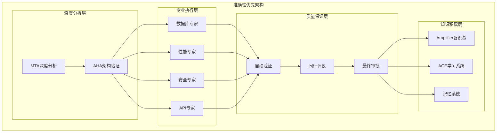

# 准确性优先的系统架构优化
## 从高并发到高准确性的战略转变

### 🎯 架构转变核心理念

**从追求速度 → 追求准确性**
- **时间预算重新分配**: 30%分析 + 40%执行 + 20%验证 + 10%文档
- **质量优先级**: 准确性 > 完整性 > 效率
- **多重验证**: 自动验证 + 同行评议 + MTA最终审批

### 📊 准确性优先的架构层次



### 🔍 深度分析机制

#### **1. 任务深度理解**
```python
class DeepTaskAnalysis:
    """深度任务分析"""

    def perform_deep_analysis(self, user_request: str) -> DeepAnalysisResult:
        """执行深度任务分析"""

        # 阶段1: 需求挖掘 (30%时间)
        requirements_analysis = self.analyze_requirements(user_request)

        # 阶段2: 约束识别 (20%时间)
        constraints_analysis = self.identify_constraints(user_request)

        # 阶段3: 成功标准定义 (25%时间)
        success_criteria = self.define_success_criteria(user_request)

        # 阶段4: 风险评估 (25%时间)
        risk_assessment = self.assess_risks(user_request)

        return DeepAnalysisResult(
            requirements=requirements_analysis,
            constraints=constraints_analysis,
            success_criteria=success_criteria,
            risks=risk_assessment
        )

    def analyze_requirements(self, request: str) -> RequirementsAnalysis:
        """深度需求分析"""

        # 功能需求
        functional_requirements = self.extract_functional_requirements(request)

        # 非功能需求
        non_functional_requirements = self.extract_non_functional_requirements(request)

        # 隐式需求
        implicit_requirements = self.infer_implicit_requirements(request)

        # 依赖需求
        dependency_requirements = self.identify_dependencies(request)

        return RequirementsAnalysis(
            functional=functional_requirements,
            non_functional=non_functional_requirements,
            implicit=implicit_requirements,
            dependencies=dependency_requirements
        )
```

#### **2. 多维度可行性分析**
```python
class MultiDimensionalFeasibilityAnalysis:
    """多维度可行性分析"""

    def analyze_feasibility(self, task: DeepAnalysisResult) -> FeasibilityReport:
        """多维度可行性分析"""

        # 技术可行性
        technical_feasibility = self.assess_technical_feasibility(task)

        # 资源可行性
        resource_feasibility = self.assess_resource_feasibility(task)

        # 时间可行性
        time_feasibility = self.assess_time_feasibility(task)

        # 质量可行性
        quality_feasibility = self.assess_quality_feasibility(task)

        return FeasibilityReport(
            technical=technical_feasibility,
            resource=resource_feasibility,
            time=time_feasibility,
            quality=quality_feasibility,
            overall_recommendation=self.generate_recommendation([
                technical_feasibility,
                resource_feasibility,
                time_feasibility,
                quality_feasibility
            ])
        )
```

### 🛠️ 专业执行机制

#### **1. 专家代理配置**
```python
class ExpertAgentConfiguration:
    """专家代理配置"""

    def configure_for_accuracy(self, agent: Agent, task: Task) -> ConfiguredAgent:
        """为准确性配置专家代理"""

        # 扩展时间预算
        extended_time_budget = self.calculate_extended_time_budget(task)

        # 启用详细日志
        detailed_logging = self.enable_detailed_logging(agent)

        # 配置质量检查点
        quality_checkpoints = self.setup_quality_checkpoints(task)

        # 配置同行评议
        peer_review_setup = self.setup_peer_review(agent, task)

        return ConfiguredAgent(
            agent=agent,
            time_budget=extended_time_budget,
            logging=detailed_logging,
            quality_checkpoints=quality_checkpoints,
            peer_review=peer_review_setup
        )

    def calculate_extended_time_budget(self, task: Task) -> TimeBudget:
        """计算扩展时间预算"""

        base_time = self.estimate_base_time(task)

        # 准确性优先的倍数
        accuracy_multiplier = 2.5

        # 复杂度调整
        complexity_adjustment = task.complexity_score * 0.5

        extended_budget = TimeBudget(
            total=base_time * accuracy_multiplier + complexity_adjustment,
            analysis=base_time * 0.4,
            execution=base_time * 0.3,
            validation=base_time * 0.2,
            documentation=base_time * 0.1
        )

        return extended_budget
```

#### **2. 协作执行协议**
```python
class CollaborativeExecutionProtocol:
    """协作执行协议"""

    async def execute_with_collaboration(self, configured_agents: List[ConfiguredAgent]) -> CollaborativeResult:
        """协作执行"""

        collaboration = CollaborativeExecution()

        # 1. 建立协作环境
        collaboration.setup_environment(configured_agents)

        # 2. 同步执行上下文
        shared_context = await collaboration.synchronize_context(configured_agents)

        # 3. 分阶段执行
        execution_phases = self.define_execution_phases(configured_agents)

        for phase in execution_phases:
            phase_result = await collaboration.execute_phase(phase, shared_context)

            # 阶段验证
            phase_validation = self.validate_phase_result(phase_result)
            if not phase_validation.is_valid:
                return self.handle_phase_failure(phase_result, phase_validation)

            # 更新共享上下文
            shared_context = collaboration.update_context(shared_context, phase_result)

        # 4. 整合结果
        integrated_result = collaboration.integrate_results(execution_phases)

        return integrated_result
```

### 🔬 质量保证机制

#### **1. 三重验证系统**
```python
class TripleValidationSystem:
    """三重验证系统"""

    def perform_triple_validation(self, result: ExecutionResult, criteria: ValidationCriteria) -> TripleValidationResult:
        """执行三重验证"""

        # 第一重: 自动化验证
        auto_validation = await self.automated_validation(result, criteria)

        if not auto_validation.passed:
            return TripleValidationResult(
                status="failed",
                primary_failure="automated_validation",
                details=auto_validation.details
            )

        # 第二重: 专家同行评议
        peer_validation = await self.expert_peer_review(result, criteria)

        if not peer_validation.consensus_reached:
            return TripleValidationResult(
                status="needs_revision",
                primary_failure="peer_review",
                details=peer_validation.review_details
            )

        # 第三重: MTA最终审批
        mta_validation = await self.mta_final_approval(result, criteria, auto_validation, peer_validation)

        return TripleValidationResult(
            status="approved" if mta_validation.approved else "rejected",
            automated_validation=auto_validation,
            peer_validation=peer_validation,
            mta_validation=mta_validation,
            overall_confidence=self.calculate_overall_confidence([
                auto_validation.confidence,
                peer_validation.confidence,
                mta_validation.confidence
            ])
        )

    async def expert_peer_review(self, result: ExecutionResult, criteria: ValidationCriteria) -> PeerReviewResult:
        """专家同行评议"""

        # 选择评议专家
        review_experts = self.select_review_experts(result.task_type)

        # 分配评议任务
        review_assignments = self.assign_review_tasks(review_experts, result)

        # 并行评议
        review_results = await asyncio.gather(*[
            self.expert_review(expert, assignment, criteria)
            for expert, assignment in review_assignments.items()
        ])

        # 分析评议一致性
        consensus_analysis = self.analyze_review_consensus(review_results)

        # 如果缺乏一致性，启动讨论
        if not consensus_analysis.consensus_reached:
            discussion_result = await self.facilitate_expert_discussion(
                review_experts, review_results, criteria
            )
            consensus_analysis = self.analyze_review_consensus([
                dr.updated_review for dr in discussion_result.participant_reviews
            ])

        return PeerReviewResult(
            expert_reviews=review_results,
            consensus_analysis=consensus_analysis,
            discussion_results=discussion_result if not consensus_analysis.consensus_reached else None,
            final_recommendation=self.generate_peer_review_recommendation(consensus_analysis)
        )
```

#### **2. 质量指标监控**
```python
class QualityMetricsMonitoring:
    """质量指标监控"""

    def monitor_quality_metrics(self, execution: Execution) -> QualityMetricsReport:
        """监控质量指标"""

        metrics = QualityMetricsReport()

        # 准确性指标
        metrics.accuracy_metrics = self.calculate_accuracy_metrics(execution)

        # 完整性指标
        metrics.completeness_metrics = self.calculate_completeness_metrics(execution)

        # 一致性指标
        metrics.consistency_metrics = self.calculate_consistency_metrics(execution)

        # 可靠性指标
        metrics.reliability_metrics = self.calculate_reliability_metrics(execution)

        # 可维护性指标
        metrics.maintainability_metrics = self.calculate_maintainability_metrics(execution)

        return metrics

    def calculate_accuracy_metrics(self, execution: Execution) -> AccuracyMetrics:
        """计算准确性指标"""

        # 功能准确性
        functional_accuracy = self.measure_functional_accuracy(execution)

        # 数据准确性
        data_accuracy = self.measure_data_accuracy(execution)

        # 逻辑准确性
        logical_accuracy = self.measure_logical_accuracy(execution)

        # 接口准确性
        interface_accuracy = self.measure_interface_accuracy(execution)

        return AccuracyMetrics(
            functional=functional_accuracy,
            data=data_accuracy,
            logical=logical_accuracy,
            interface=interface_accuracy,
            overall_accuracy=self.calculate_overall_accuracy([
                functional_accuracy,
                data_accuracy,
                logical_accuracy,
                interface_accuracy
            ])
        )
```

### 📚 知识积累与学习

#### **1. 准确性模式学习**
```python
class AccuracyPatternLearning:
    """准确性模式学习"""

    def learn_from_accuracy_patterns(self, execution_history: List[Execution]) -> AccuracyPatterns:
        """从准确性模式中学习"""

        patterns = AccuracyPatterns()

        # 成功模式识别
        success_patterns = self.identify_success_patterns(execution_history)
        patterns.success_patterns = success_patterns

        # 失败模式识别
        failure_patterns = self.identify_failure_patterns(execution_history)
        patterns.failure_patterns = failure_patterns

        # 准确性提升策略
        improvement_strategies = self.generate_improvement_strategies(
            success_patterns, failure_patterns
        )
        patterns.improvement_strategies = improvement_strategies

        # 更新智识基
        await self.update_knowledge_base_with_patterns(patterns)

        return patterns

    async def update_knowledge_base_with_patterns(self, patterns: AccuracyPatterns):
        """用模式更新智识基"""

        knowledge_updates = []

        # 成功模式文档化
        for pattern in patterns.success_patterns:
            update = KnowledgeUpdate(
                type="success_pattern",
                title=pattern.title,
                content=self.format_pattern_as_markdown(pattern),
                category="accuracy_best_practices",
                confidence=pattern.confidence_score,
                tags=pattern.tags
            )
            knowledge_updates.append(update)

        # 失败模式文档化
        for pattern in patterns.failure_patterns:
            update = KnowledgeUpdate(
                type="failure_pattern",
                title=pattern.title,
                content=self.format_pattern_as_markdown(pattern),
                category="accuracy_pitfalls",
                confidence=pattern.confidence_score,
                tags=pattern.tags
            )
            knowledge_updates.append(update)

        # 写入Amplifier智识基
        await self.write_to_amplifier_knowledge_base(knowledge_updates)
```

### 🎯 准确性优先的具体配置

#### **1. 时间分配策略**
```python
class AccuracyFirstTimeAllocation:
    """准确性优先时间分配"""

    ALLOCATION_STRATEGY = {
        "deep_analysis": 0.30,      # 30% 深度分析
        "expert_execution": 0.40,   # 40% 专家执行
        "quality_validation": 0.20, # 20% 质量验证
        "documentation": 0.10       # 10% 文档化
    }

    def allocate_time_for_task(self, task: Task) -> TimeAllocation:
        """为任务分配时间"""

        base_time = self.estimate_base_time(task)

        # 准确性优先的扩展
        accuracy_multiplier = self.get_accuracy_multiplier(task)

        total_time = base_time * accuracy_multiplier

        return TimeAllocation(
            total=total_time,
            deep_analysis=total_time * self.ALLOCATION_STRATEGY["deep_analysis"],
            expert_execution=total_time * self.ALLOCATION_STRATEGY["expert_execution"],
            quality_validation=total_time * self.ALLOCATION_STRATEGY["quality_validation"],
            documentation=total_time * self.ALLOCATION_STRATEGY["documentation"]
        )

    def get_accuracy_multiplier(self, task: Task) -> float:
        """获取准确性倍数"""

        base_multiplier = 2.0

        # 基于复杂度的调整
        complexity_multiplier = 1.0 + (task.complexity_score * 0.3)

        # 基于关键性的调整
        criticality_multiplier = 1.0 + (task.criticality_score * 0.4)

        # 基于风险的调整
        risk_multiplier = 1.0 + (task.risk_score * 0.3)

        return base_multiplier * complexity_multiplier * criticality_multiplier * risk_multiplier
```

#### **2. 质量标准配置**
```python
class AccuracyQualityStandards:
    """准确性质量标准"""

    QUALITY_THRESHOLDS = {
        "functional_accuracy": 0.95,      # 95% 功能准确性
        "data_integrity": 0.98,           # 98% 数据完整性
        "error_rate": 0.01,               # 1% 错误率
        "consistency_score": 0.90,        # 90% 一致性
        "peer_review_consensus": 0.85     # 85% 同行评议一致性
    }

    def validate_quality_standards(self, result: ExecutionResult) -> QualityValidationResult:
        """验证质量标准"""

        validations = []

        for metric, threshold in self.QUALITY_THRESHOLDS.items():
            measured_value = self.measure_quality_metric(result, metric)

            validation = QualityValidation(
                metric=metric,
                threshold=threshold,
                measured_value=measured_value,
                passed=measured_value >= threshold,
                deviation=measured_value - threshold
            )

            validations.append(validation)

        # 计算整体质量分数
        overall_quality = self.calculate_overall_quality_score(validations)

        return QualityValidationResult(
            individual_validations=validations,
            overall_quality_score=overall_quality,
            meets_all_standards=all(v.passed for v in validations),
            needs_improvement=[v for v in validations if not v.passed]
        )
```

### 📊 性能监控与反馈

```python
class AccuracyPerformanceMonitoring:
    """准确性性能监控"""

    def monitor_accuracy_performance(self, system: AccuracyFirstSystem) -> PerformanceReport:
        """监控准确性性能"""

        report = PerformanceReport()

        # 准确性趋势
        accuracy_trends = self.analyze_accuracy_trends(system.execution_history)
        report.accuracy_trends = accuracy_trends

        # 质量改进率
        improvement_rate = self.calculate_improvement_rate(system.learning_history)
        report.improvement_rate = improvement_rate

        # 效率指标 (平衡准确性)
        efficiency_metrics = self.calculate_efficiency_metrics(system)
        report.efficiency_metrics = efficiency_metrics

        # 用户满意度
        satisfaction_metrics = self.measure_user_satisfaction(system)
        report.satisfaction_metrics = satisfaction_metrics

        return report
```

### 🎯 总结

**准确性优先架构的核心优势：**

1. **深度分析**: 30%时间用于深入理解任务需求
2. **专家执行**: 40%时间由专业代理仔细执行
3. **多重验证**: 三重验证确保输出质量
4. **持续学习**: 从每次执行中学习准确性模式
5. **知识积累**: 构建准确性最佳实践知识库

**实施策略：**
- 扩展时间预算 (2.5x基准时间)
- 严格质量检查点
- 专家同行评议机制
- MTA最终审批流程
- 持续监控和改进