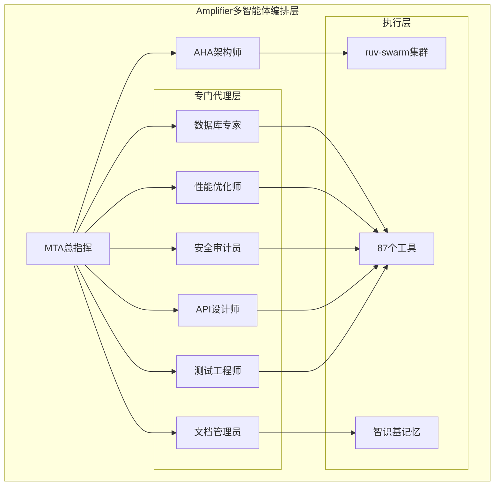

# 多智能体编排机制详细解析
## 基于Amplifier架构的准确性优先设计

### 🎯 核心编排架构



### 📋 任务分解与协同执行流程

#### **第一阶段：任务分析与分解**
```python
class MTATaskDecomposition:
    """MTA任务分解机制"""

    def analyze_complex_task(self, user_request: str) -> TaskBreakdown:
        """
        分析复杂任务并分解为子任务
        优先准确性，确保每个子任务都有明确的验收标准
        """

        # 1. 任务理解阶段
        task_analysis = self.comprehend_task(user_request)

        # 2. 分解为可执行的子任务
        subtasks = self.decompose_to_atomic_tasks(task_analysis)

        # 3. 确定依赖关系
        dependencies = self.analyze_dependencies(subtasks)

        # 4. 分配专门代理
        agent_assignments = self.assign_specialized_agents(subtasks)

        return TaskBreakdown(
            analysis=task_analysis,
            subtasks=subtasks,
            dependencies=dependencies,
            assignments=agent_assignments
        )

    def comprehend_task(self, user_request: str) -> TaskAnalysis:
        """深入理解任务需求"""
        return TaskAnalysis(
            objective=self.extract_objective(user_request),
            requirements=self.identify_requirements(user_request),
            constraints=self.identify_constraints(user_request),
            success_criteria=self.define_success_criteria(user_request),
            accuracy_requirements=self.define_accuracy_standards(user_request)
        )
```

#### **第二阶段：智能体分配与协调**
```python
class AgentCoordinationEngine:
    """智能体协调引擎"""

    def coordinate_execution(self, task_breakdown: TaskBreakdown) -> ExecutionPlan:
        """协调多智能体执行"""

        execution_plan = ExecutionPlan()

        # 1. 串行任务链
        sequential_tasks = self.identify_sequential_tasks(task_breakdown)
        for task_chain in sequential_tasks:
            execution_plan.add_sequential_chain(task_chain)

        # 2. 并行任务组
        parallel_tasks = self.identify_parallel_tasks(task_breakdown)
        for task_group in parallel_tasks:
            execution_plan.add_parallel_group(task_group)

        # 3. 协作任务网络
        collaborative_tasks = self.identify_collaborative_tasks(task_breakdown)
        for task_network in collaborative_tasks:
            execution_plan.add_collaboration_network(task_network)

        return execution_plan

    def assign_optimal_agent(self, task: SubTask) -> Agent:
        """为任务分配最优代理"""

        # 基于准确性匹配
        agent_capabilities = {
            'database_migration': self.database_expert,
            'performance_optimization': self.performance_optimizer,
            'security_audit': self.security_auditor,
            'api_design': self.api_designer,
            'testing': self.testing_engineer,
            'documentation': self.documentation_manager
        }

        # 选择最匹配的代理
        best_agent = self.match_agent_to_task(task, agent_capabilities)

        # 确保代理有足够的时间和质量保证
        return self.configure_agent_for_accuracy(best_agent, task)
```

#### **第三阶段：协同执行与质量控制**
```python
class CollaborativeExecution:
    """协同执行机制"""

    async def execute_with_quality_control(self, execution_plan: ExecutionPlan) -> ExecutionResult:
        """带质量控制的协同执行"""

        results = ExecutionResult()

        # 1. 执行串行任务链
        for chain in execution_plan.sequential_chains:
            chain_result = await self.execute_sequential_chain(chain)
            results.add_chain_result(chain_result)

            # 质量检查点
            if not self.quality_gate_check(chain_result):
                return self.handle_quality_failure(chain_result)

        # 2. 执行并行任务组
        for group in execution_plan.parallel_groups:
            group_result = await self.execute_parallel_group(group)
            results.add_group_result(group_result)

            # 交叉验证
            if not self.cross_validate_results(group_result):
                return self.handle_validation_failure(group_result)

        # 3. 执行协作任务网络
        for network in execution_plan.collaboration_networks:
            network_result = await self.execute_collaboration_network(network)
            results.add_network_result(network_result)

        return results

    async def execute_sequential_chain(self, task_chain: SequentialChain) -> ChainResult:
        """执行串行任务链"""

        chain_result = ChainResult()

        for i, task in enumerate(task_chain.tasks):
            # 执行当前任务
            task_result = await self.execute_single_task(task)
            chain_result.add_task_result(task_result)

            # 验证任务结果
            validation_result = self.validate_task_output(task_result, task.success_criteria)

            if not validation_result.is_valid:
                # 重试机制
                if task.retry_count < task.max_retries:
                    await self.retry_task(task, validation_result.feedback)
                else:
                    return self.handle_task_failure(task, validation_result)

            # 为下一个任务准备上下文
            if i < len(task_chain.tasks) - 1:
                next_task = task_chain.tasks[i + 1]
                self.prepare_next_task_context(next_task, task_result)

        return chain_result
```

### 🔍 准确性优先的核心机制

#### **1. 三重验证机制**
```python
class TripleValidationSystem:
    """三重验证系统"""

    def validate_task_output(self, result: TaskResult, criteria: SuccessCriteria) -> ValidationResult:
        """三重验证任务输出"""

        # 第一重：自动化验证
        auto_validation = self.automated_validation(result, criteria)

        # 第二重：代理交叉验证
        peer_validation = self.peer_agent_validation(result, criteria)

        # 第三重：MTA最终验证
        mta_validation = self.mta_final_validation(result, criteria)

        return ValidationResult(
            automated=auto_validation,
            peer_review=peer_validation,
            mta_approval=mta_validation,
            overall_confidence=self.calculate_overall_confidence([
                auto_validation.confidence,
                peer_validation.confidence,
                mta_validation.confidence
            ])
        )

    def automated_validation(self, result: TaskResult, criteria: SuccessCriteria) -> Validation:
        """自动化验证"""

        validations = []

        # 功能正确性验证
        functional_check = self.check_functional_correctness(result, criteria)
        validations.append(functional_check)

        # 性能标准验证
        performance_check = self.check_performance_standards(result, criteria)
        validations.append(performance_check)

        # 安全标准验证
        security_check = self.check_security_standards(result, criteria)
        validations.append(security_check)

        # 代码质量验证
        quality_check = self.check_code_quality(result, criteria)
        validations.append(quality_check)

        return Validation(
            checks=validations,
            confidence=self.calculate_validation_confidence(validations),
            feedback=self.generate_validation_feedback(validations)
        )
```

#### **2. 智能体间协作机制**
```python
class AgentCollaborationProtocol:
    """智能体协作协议"""

    async def facilitate_collaboration(self, task_network: CollaborationNetwork) -> CollaborationResult:
        """促进智能体协作"""

        collaboration = CollaborationResult()

        # 1. 建立协作上下文
        shared_context = self.establish_shared_context(task_network)

        # 2. 初始化协作通道
        communication_channels = self.setup_communication_channels(task_network.agents)

        # 3. 协作执行
        while not task_network.is_complete():

            # 收集各代理的状态
            agent_states = await self.collect_agent_states(task_network.agents)

            # 分析协作依赖
            dependencies = self.analyze_collaboration_dependencies(agent_states)

            # 解决冲突和竞争
            conflicts = self.identify_conflicts(dependencies)
            if conflicts:
                resolutions = await self.resolve_conflicts(conflicts, communication_channels)
                self.apply_resolutions(resolutions)

            # 同步进度
            sync_result = await self.synchronize_progress(task_network.agents, shared_context)
            collaboration.add_sync_result(sync_result)

            # 检查协作完成条件
            if self.check_collaboration_completion(task_network, agent_states):
                break

        # 4. 协作结果整合
        integrated_result = self.integrate_collaborative_outputs(task_network.agents)
        collaboration.set_integrated_result(integrated_result)

        return collaboration
```

#### **3. 适应性学习机制**
```python
class AdaptiveLearningSystem:
    """适应性学习系统"""

    def learn_from_execution(self, execution_result: ExecutionResult) -> LearningInsights:
        """从执行结果中学习"""

        insights = LearningInsights()

        # 1. 分析成功模式
        success_patterns = self.analyze_success_patterns(execution_result)
        insights.add_success_patterns(success_patterns)

        # 2. 识别失败原因
        failure_causes = self.identify_failure_causes(execution_result)
        insights.add_failure_causes(failure_causes)

        # 3. 优化代理分配策略
        allocation_improvements = self.optimize_agent_allocation(execution_result)
        insights.add_allocation_improvements(allocation_improvements)

        # 4. 改进任务分解方法
        decomposition_improvements = self.improve_task_decomposition(execution_result)
        insights.add_decomposition_improvements(decomposition_improvements)

        # 5. 更新智识基
        await self.update_knowledge_base(insights)

        return insights

    async def update_knowledge_base(self, insights: LearningInsights):
        """更新Amplifier智识基"""

        knowledge_updates = []

        # 更新最佳实践
        for pattern in insights.success_patterns:
            knowledge_update = KnowledgeUpdate(
                type="best_practice",
                content=pattern.to_markdown(),
                category="execution_patterns",
                confidence=pattern.confidence_score
            )
            knowledge_updates.append(knowledge_update)

        # 更新故障排除指南
        for cause in insights.failure_causes:
            knowledge_update = KnowledgeUpdate(
                type="troubleshooting",
                content=cause.to_markdown(),
                category="failure_analysis",
                confidence=cause.frequency_score
            )
            knowledge_updates.append(knowledge_update)

        # 写入智识基
        await self.write_to_knowledge_base(knowledge_updates)
```

### 🎯 准确性优先的具体实施

#### **1. 时间预算分配**
```python
class AccuracyFirstTimeAllocation:
    """准确性优先的时间分配"""

    def allocate_time_budget(self, task_complexity: TaskComplexity) -> TimeBudget:
        """分配时间预算"""

        base_time = self.calculate_base_time(task_complexity)

        # 准确性优先的时间分配
        allocation = TimeBudget(
            analysis_phase=base_time * 0.3,      # 30% 用于深入分析
            execution_phase=base_time * 0.4,     # 40% 用于仔细执行
            validation_phase=base_time * 0.2,    # 20% 用于验证
            documentation_phase=base_time * 0.1   # 10% 用于文档化
        )

        return allocation
```

#### **2. 质量保证检查点**
```python
class QualityAssuranceCheckpoints:
    """质量保证检查点"""

    def setup_quality_checkpoints(self, execution_plan: ExecutionPlan) -> List[QualityCheckpoint]:
        """设置质量检查点"""

        checkpoints = []

        # 关键决策点检查
        for decision_point in execution_plan.decision_points:
            checkpoint = QualityCheckpoint(
                type="decision_review",
                location=decision_point.location,
                criteria=decision_point.quality_criteria,
                reviewers=self.select_reviewers(decision_point),
                required_approval_level="high"
            )
            checkpoints.append(checkpoint)

        # 集成点检查
        for integration_point in execution_plan.integration_points:
            checkpoint = QualityCheckpoint(
                type="integration_validation",
                location=integration_point.location,
                criteria=integration_point.validation_criteria,
                reviewers=self.select_integration_validators(integration_point),
                required_approval_level="critical"
            )
            checkpoints.append(checkpoint)

        return checkpoints
```

### 📊 性能监控与反馈

```python
class AccuracyMonitoringSystem:
    """准确性监控系统"""

    def monitor_execution_accuracy(self, execution: Execution) -> AccuracyMetrics:
        """监控执行准确性"""

        metrics = AccuracyMetrics()

        # 任务完成质量
        metrics.task_quality_score = self.calculate_task_quality(execution.results)

        # 协作效率
        metrics.collaboration_efficiency = self.calculate_collaboration_efficiency(execution.collaborations)

        # 决策准确性
        metrics.decision_accuracy = self.calculate_decision_accuracy(execution.decisions)

        # 学习改进率
        metrics.learning_improvement_rate = self.calculate_learning_rate(execution.learning_outcomes)

        return metrics
```

### 🎯 总结

**多智能体编排的核心优势：**

1. **专业化分工** - 每个代理专注特定领域，确保深度专业性
2. **协作增强** - 通过协作提升整体决策质量
3. **质量保证** - 三重验证机制确保输出准确性
4. **持续学习** - 从每次执行中学习，不断优化
5. **适应性调整** - 根据任务复杂度动态调整策略

**准确性优先的实现方式：**
- 充足的时间预算分配
- 严格的质量检查点
- 多重验证机制
- 协作交叉验证
- 持续学习优化