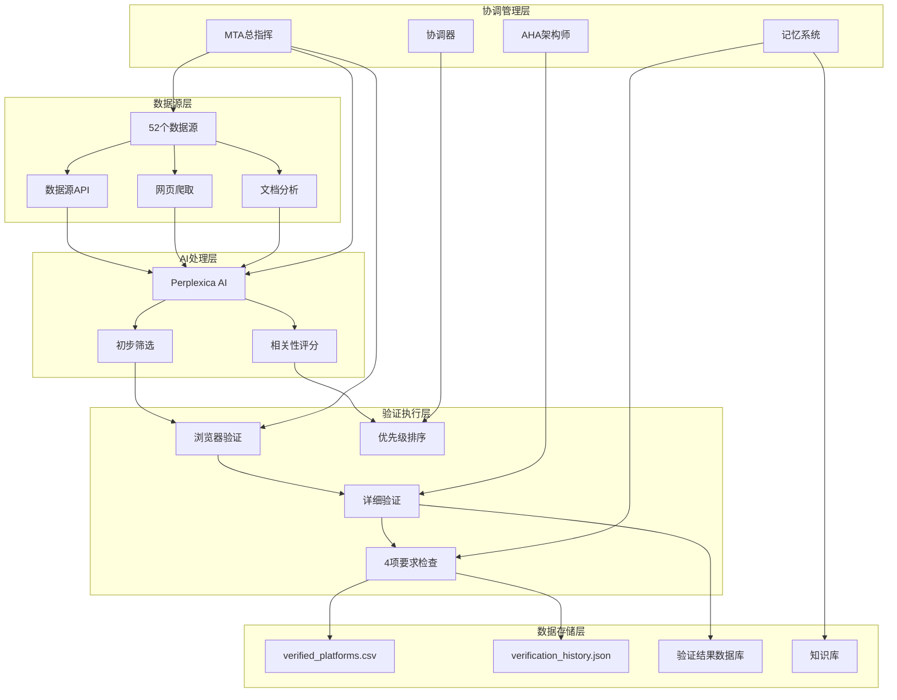

# 美国支付平台自动化验证系统 - 产品规格说明书

## 🎯 产品概述

### 产品愿景
构建一个完全自动化的美国支付平台发现和验证系统，通过AI驱动的大规模筛选，持续发现并验证符合4项严格要求的支付平台，最大化验证通过平台总数。

### 核心价值主张
- **技术发现引擎** - 自动化发现符合技术标准的支付平台
- **智能验证系统** - AI + 浏览器模拟双重验证机制
- **持续运营能力** - 7x24不间断平台发现和验证
- **技术资产积累** - 构建支付技术数据库和验证知识库

## 📋 功能规格

### 核心功能模块

#### 1. 数据源发现引擎 (Data Source Discovery Engine)

**功能描述**: 自动化发现和收录支付平台数据源，支持动态关键词优化和源质量评估。

**用户故事**:
- 作为系统管理员，我希望能够自动发现新的支付平台数据源，以保持验证系统的覆盖范围。
- 作为技术运营者，我需要评估不同数据源的质量和相关性，以优化搜索效率。

**使用场景**:
```
场景1: 初始数据源收录
输入: ["US payment platforms", "Stripe Connect", "fintech marketplaces"]
处理:
1. 并行搜索52个预置数据源
2. AI初步筛选相关性评分
3. 人工确认高质量源
4. 动态更新搜索策略
输出: 按相关性排序的数据源列表

场景2: 持续源发现
触发: 每轮验证完成后
动作:
1. 分析验证成功率
2. 调整搜索关键词组合
3. 发现并测试新数据源
4. 更新源质量评分
```

**输入输出定义**:
```javascript
// 输入
interface DataSourceQuery {
  keywords: string[];          // 搜索关键词数组
  categories: string[];         // 平台类别过滤
  region: "US" | "Global";     // 地理位置过滤
  minAuthority: number;         // 最小权威性评分
  lastSearchTime?: Date;        // 上次搜索时间
}

// 输出
interface DataSourceResult {
  sources: DataSource[];
  totalFound: number;
  processingTime: number;
  searchStrategy: {
    keywordsUsed: string[];
    filtersApplied: string[];
    relevanceScores: number[];
  };
}
```

**边界条件处理**:
- **空关键词处理** - 使用默认关键词集合 ["US payment platforms", "Stripe Connect"]
- **无结果处理** - 自动扩展搜索范围，调整关键词策略
- **源失效处理** - 标记失效源，切换备用源
- **重复源检测** - 基于URL和内容相似度去重

#### 2. AI初步筛选系统 (AI Pre-filtering System)

**功能描述**: 使用Perplexica进行平台初步筛选，验证4项严格要求的基本符合性，减少无效浏览器验证。

**用户故事**:
- 作为验证工程师，我希望在投入浏览器验证资源之前，先用AI快速筛选掉明显不符合要求的平台。
- 作为系统优化者，我需要了解AI筛选的准确率，以持续优化筛选模型。

**使用场景**:
```
场景1: 批量平台初筛
输入: 15-20个潜在平台URL
处理流程:
1. Perplexica并行查询每个平台
2. 验证4项基本要求:
   - 美国市场服务
   - 自注册功能可用
   - P2P收款支持
   - 支付集成类型
3. 生成符合性评分报告
4. 决策: 通过/拒绝/需要人工审核
输出: 按优先级排序的平台列表

场景2: 筛选策略学习
触发: 每轮验证完成后
学习内容:
- 分析初筛准确率
- 识别误判模式
- 调整验证查询模板
- 更新平台特征库
```

**输入输出定义**:
```javascript
// 输入
interface PlatformPreFilterRequest {
  platforms: {
    url: string;
    name?: string;
    category?: string;
  }[];
  verificationCriteria: {
    usMarket: boolean;
    selfRegistration: boolean;
    p2pPayment: boolean;
    paymentIntegration: boolean;
  };
}

// 输出
interface PreFilterResult {
  results: PreFilterPlatformResult[];
  summary: {
    totalProcessed: number;
    passed: number;
    rejected: number;
    needsManualReview: number;
    accuracy: number;
  };
}

interface PreFilterPlatformResult {
  platform: Platform;
  decision: "PASS" | "REJECT" | "MANUAL_REVIEW";
  confidence: number;              // 0-1 置信度
  reasons: string[];             // 决策原因
  suggestedTests?: string[];     // 推荐测试项目
}
```

**边界条件处理**:
- **AI查询失败** - 重试3次，失败后标记为"需要人工审核"
- **置信度低** - 自动标记为"需要人工审核"，并建议人工验证重点
- **信息不完整** - 基于可用信息做出最佳判断，标注不确定性
- **源不可达** - 记录失败原因，跳过该平台

#### 3. 浏览器模拟验证系统 (Browser Simulation Verification)

**功能描述**: 多层级浏览器模拟验证，处理不同的反爬虫机制，确保4项要求的100%验证。

**用户故事**:
- 作为验证专员，我需要系统能够自动处理不同的访问限制，确保验证过程不被阻拦。
- 作为数据质量负责人，我需要确保每个验证结果都是准确可靠的，避免误判。

**使用场景**:
```
场景1: 多层级验证流程
输入: 通过初筛的平台列表
验证层级:
Level 1: 云端IP + 无头浏览器
├── 成功 → 继续完整验证
└── 失败 → Level 2

Level 2: 无头浏览器 + 本地IP
├── 成功 → 继续完整验证
└── 失败 → Level 3

Level 3: 真实浏览器 (headless=false)
├── 成功 → 继续完整验证
└── 失败 → 排除平台

场景2: 详细验证流程
对每个通过访问控制的平台:
1. 服务区域验证 (About页, Terms)
2. 注册流程测试 (实际操作)
3. API文档检查 (开发者资源)
4. 支付设置验证 (后台配置)
5. 测试账户申请 (如可用)
```

**输入输出定义**:
```javascript
// 输入
interface BrowserVerificationRequest {
  platform: Platform;
  verificationDepth: "BASIC" | "STANDARD" | "COMPREHENSIVE";
  timeoutSettings: {
    pageLoad: number;
    elementWait: number;
    total: number;
  };
  proxySettings?: {
    useCloud: boolean;
    rotateIP: boolean;
    localFallback: boolean;
  };
}

// 输出
interface BrowserVerificationResult {
  platform: Platform;
  accessLevel: "CLOUD" | "LOCAL" | "REAL" | "FAILED";
  verificationStatus: "SUCCESS" | "PARTIAL" | "FAILED";
  requirementsCheck: {
    usMarket: VerificationStatus;
    selfRegistration: VerificationStatus;
    p2pPayment: VerificationStatus;
    paymentIntegration: VerificationStatus;
  };
  details: {
    registrationType?: string[];     // SSN, 证件, 生物验证等
    paymentIntegrationType?: string; // Stripe Express/Custom, 自带支付
    settlementTimes?: {
      firstPayment: string;           // "2min", "24hours", "unknown"
      secondPayment: string;
    };
    whiteLabel?: boolean;
    singleAccount?: boolean;
  };
  technicalDetails: {
    browserUsed: string;
    proxySettings: string;
    accessTime: number;
    errors?: string[];
  };
}

enum VerificationStatus {
  "CONFIRMED",           // 100%确认符合
  "LIKELY",              // 高度符合
  "PARTIAL",             // 部分符合
  "UNLIKELY",            // 不太符合
  "NOT_FOUND",            // 未找到相关信息
  "UNABLE_TO_DETERMINE"   // 无法确定
}
```

**边界条件处理**:
- **访问控制规避** - 按层级切换策略，避免IP封禁
- **验证超时** - 记录超时原因，调整后续验证策略
- **页面结构变化** - 动态适应不同平台的页面布局
- **验证中断** - 保存断点，支持从中断处继续

#### 4. 数据记录与管理系统 (Data Recording & Management)

**功能描述**: 维护验证历史和结果数据库，确保100%无重复验证，支持数据分析和趋势监控。

**用户故事**:
- 作为数据分析师，我需要查看历史验证数据，分析发现趋势和验证效率。
- 作为系统管理员，我需要确保验证数据的完整性和一致性。

**使用场景**:
```
场景1: 重复检测机制
输入: 新平台URL
处理流程:
1. 查询verification_history.json
2. URL匹配检查
3. 时间戳对比
4. 结果验证
输出: 已验证/未验证状态

场景2: 数据统计分析
触发: 每轮验证完成
分析内容:
- 验证通过率趋势
- 数据源质量变化
- 验证效率指标
- 失败模式分析
输出: 统计报告和改进建议

场景3: CSV报告生成
触发: 每轮验证后
生成内容:
- 新增验证通过平台
- 按到账时间排序
- 包含所有技术细节
输出: 标准化CSV文件
```

**输入输出定义**:
```javascript
// 输入
interface DataRecord {
  platform: Platform;
  verificationDate: Date;
  verificationResult: "PASSED" | "FAILED" | "PARTIAL";
  verificationDetails: RequirementCheckResult;
  performanceMetrics: {
    totalVerificationTime: number;
    aiPreFilterTime: number;
    browserVerificationTime: number;
  };
  dataSource: string;           // 发现来源
  searchKeywords?: string[];     // 搜索关键词
}

interface RequirementCheckResult {
  usMarket: VerificationStatus;
  selfRegistration: VerificationStatus;
  p2pPayment: VerificationStatus;
  paymentIntegration: VerificationStatus;
}

// 输出
interface CSVExportFormat {
  platformWebsite: string;
  industry: string;
  firstSettlementTime: string;      // "2min", "24hours", "unknown"
  secondSettlementTime: string;
  whiteLabelAccount: "Yes" | "No" | "Unknown";
  singleAccount: "Yes" | "No" | "Unknown";
  registrationVerificationType: string;
  verificationDate: Date;
}

interface VerificationHistory {
  totalPlatformsVerified: number;
  uniquePlatforms: number;
  verificationResults: {
    passed: number;
    failed: number;
    partial: number;
  };
  averageVerificationTime: number;
  topPerformingSources: string[];
  recentActivity: DataRecord[];
}
```

**边界条件处理**:
- **数据冲突** - 基于时间戳和置信度保留最新结果
- **存储失败** - 重试机制，失败后记录到错误日志
- **格式错误** - 数据清洗和标准化处理
- **并发访问** - 乐观锁机制，确保数据一致性

#### 5. 工具与代理协调系统 (Tools & Agents Coordination)

**功能描述**: 协调AI Agents、MCP工具和验证工具链，实现并行化验证和智能化任务分配。

**用户故事**:
- 作为系统架构师，我需要能够灵活配置不同的验证代理和工具，以适应各种验证场景。
- 作为性能优化师，我需要监控各组件的性能指标，持续优化系统效率。

**使用场景**:
```
场景1: 并行验证任务分配
输入: 10个待验证平台
协调流程:
1. MTA总指挥分析平台特征
2. 分配到专业验证代理:
   - Web Scraping Agent: 网站结构分析
   - API Testing Agent: 集成接口验证
   - Document Analysis Agent: 条款政策检查
3. 启动MCP工具链:
   - File Access MCP: 验证记录管理
   - Database MCP: 结果存储查询
   - Web Scraping MCP: 数据源更新
4. 实时监控和协调
输出: 并行验证结果汇总

场景2: 自适应资源调度
触发条件: 系统负载监控
调度策略:
- CPU高负载 → 减少并行代理数
- 内存紧张 → 启动垃圾回收
- 网络延迟 → 切换备用数据源
- 错误率上升 → 降低验证频率
```

**输入输出定义**:
```javascript
// 输入
interface CoordinationRequest {
  platforms: Platform[];
  strategy: "PARALLEL" | "SEQUENTIAL" | "ADAPTIVE";
  resourceConstraints: {
    maxConcurrentAgents: number;
    maxMemoryUsage: number;
    timeout: number;
  };
  availableAgents: AgentType[];
  availableMCPs: MCPType[];
}

enum AgentType {
  "WEB_SCRAPING",      // 网站数据抓取
  "API_TESTING",        // API接口测试
  "DOCUMENT_ANALYSIS",  // 文档分析
  "DATA_VALIDATION",    // 数据验证
  "COORDINATION"         // 任务协调
}

enum MCPType {
  "FILE_ACCESS",        // 文件系统访问
  "DATABASE",          // 数据库操作
  "WEB_SCRAPING",      // 网页抓取
  "API_INTEGRATION",    // API集成
  "NOTIFICATION"        // 通知系统
}

// 输出
interface CoordinationResult {
  taskId: string;
  startTime: Date;
  endTime: Date;
  totalDuration: number;
  agentPerformance: {
    [key in AgentType]: {
      assignedTasks: number;
      completedTasks: number;
      averageTime: number;
      successRate: number;
    };
  };
  mcpUtilization: {
    [key in MCPType]: {
      callsCount: number;
      averageResponseTime: number;
      errorRate: number;
    };
  };
  finalResults: ValidationResult[];
  systemMetrics: {
    cpuUsage: number[];
    memoryUsage: number[];
    networkLatency: number[];
  };
}
```

**边界条件处理**:
- **Agent失效** - 自动重启机制，失败后重新分配任务
- **MCP连接失败** - 切换备用MCP服务，记录故障日志
- **资源竞争** - 智能优先级调度，关键任务优先
- **网络分区** - 本地缓存模式，网络恢复后同步

## 🏗️ 技术规格

### 系统架构设计



### 数据模型定义

#### 平台实体 (Platform Entity)
```typescript
interface Platform {
  id: string;                              // 唯一标识符
  url: string;                             // 平台官网URL
  name: string;                            // 平台名称
  category: PaymentPlatformCategory;     // 平台类别
  description?: string;                   // 平台描述
  discoveredAt: Date;                      // 发现时间
  lastVerified?: Date;                   // 上次验证时间
  verificationStatus: VerificationStatus; // 验证状态
  discoverySource: string;                 // 发现来源
  searchKeywords: string[];              // 搜索关键词
}

enum PaymentPlatformCategory {
  "STRIPE_CONNECT",      // Stripe Connect平台
  "NATIVE_PAYMENT",      // 自建支付平台
  "MARKETPLACE",         // 市场平台
  "PSP",                  // 支付服务提供商
  "FINTECH",             // 金融科技平台
  "EMBEDDED_FINANCE"     // 嵌入式金融
}
```

#### 验证结果实体 (Verification Result Entity)
```typescript
interface VerificationResult {
  platformId: string;
  verificationDate: Date;
  overallStatus: "PASSED" | "FAILED" | "PARTIAL" | "UNKNOWN";
  requirementChecks: {
    usMarket: RequirementCheck;
    selfRegistration: RequirementCheck;
    p2pPayment: RequirementCheck;
    paymentIntegration: RequirementCheck;
  };
  technicalDetails: TechnicalDetails;
  performanceMetrics: PerformanceMetrics;
}

interface RequirementCheck {
  status: VerificationStatus;
  confidence: number;              // 0-1 置信度
  evidence?: string[];             // 证据链
  verificationMethod: "AI_ANALYSIS" | "BROWSER_SIMULATION" | "MANUAL_REVIEW";
  lastChecked: Date;
}

interface TechnicalDetails {
  registrationType?: string[];           // SSN, EIN, 证件, 生物验证
  paymentIntegrationType: PaymentIntegrationType;
  settlementTimes: SettlementTimes;
  accountFeatures: AccountFeatures;
  supportedRegions?: string[];         // 支持地区
  complianceNotes?: string;           // 合规备注
}

enum PaymentIntegrationType {
  "STRIPE_EXPRESS",       // Stripe Express
  "STRIPE_CUSTOM",        // Stripe Custom
  "NATIVE_PROCESSOR",     // 自建处理器
  "THIRD_PARTY",           // 第三方网关
  "HYBRID"               // 混合模式
}

interface SettlementTimes {
  firstPayment: TimeEstimate;    // 首次到账时间
  secondPayment: TimeEstimate;   // 第二次到账时间
}

interface TimeEstimate {
  value: string;               // "2min", "1hour", "24hours", "unknown"
  confidence: number;           // 0-1 置信度
  source: "DOCUMENTATION" | "TESTING" | "ESTIMATION";
}

interface AccountFeatures {
  whiteLabel: boolean;           // 白标账户
  singleAccount: boolean;          // 单一账户模式
  multiUser: boolean;             // 多用户支持
  sandboxAvailable: boolean;       // 测试环境
  apiAccess: boolean;             // API访问权限
}
```

#### 性能指标实体 (Performance Metrics Entity)
```typescript
interface PerformanceMetrics {
  verification: VerificationMetrics;
  system: SystemMetrics;
  quality: QualityMetrics;
}

interface VerificationMetrics {
  totalDuration: number;           // 总验证时长(毫秒)
  aiPreFilterDuration: number;     // AI初筛时长
  browserSimulationDuration: number; // 浏览器模拟时长
  dataCollectionDuration: number;    // 数据收集时长
  successRate: number;             // 成功率
  timeoutRate: number;            // 超时率
  errorRate: number;              // 错误率
}

interface SystemMetrics {
  cpuUsage: number;               // CPU使用率(%)
  memoryUsage: number;            // 内存使用量(MB)
  diskUsage: number;               // 磁盘使用量(MB)
  networkLatency: number;         // 网络延迟(毫秒)
  concurrentTasks: number;         // 并发任务数
  activeAgents: number;            // 活跃代理数
}

interface QualityMetrics {
  dataAccuracy: number;           // 数据准确率
  completeness: number;             // 完整性评分
  consistency: number;             // 一致性评分
  freshness: number;               // 数据新鲜度
  reliability: number;            // 可靠性评分
}
```

### 性能指标要求

#### 系统性能指标
- **响应时间**: API请求 < 2秒, 页面加载 < 5秒
- **并发处理**: 支持50个并发验证任务
- **资源利用率**: CPU < 80%, 内存 < 4GB, 磁盘 < 1GB
- **可用性**: 99.5%系统可用性
- **错误率**: < 1%系统错误率

#### 验证性能指标
- **初筛准确率**: > 85% AI初步筛选准确率
- **验证成功率**: > 95%浏览器验证成功率
- **重复检测率**: 100%无重复验证
- **数据完整性**: > 98%验证数据完整
- **更新频率**: 实时数据更新能力

#### 扩展性指标
- **水平扩展**: 支持增加验证节点，线性性能提升
- **垂直扩展**: 支持硬件升级，性能相应提升
- **负载均衡**: 自动任务分配和负载均衡
- **弹性伸缩**: 基于负载自动调整资源

### 安全要求

#### 数据安全
- **传输加密**: 所有数据传输使用TLS 1.3+
- **存储加密**: 敏感数据AES-256加密存储
- **访问控制**: 基于角色的访问控制(RBAC)
- **审计日志**: 完整的操作审计日志

#### 系统安全
- **输入验证**: 所有输入数据严格验证和清理
- **SQL注入防护**: 参数化查询，防止注入攻击
- **XSS防护**: 输出内容转义和过滤
- **CSRF防护**: 跨站请求伪造保护

#### 隐私合规
- **GDPR合规**: 欧盟数据保护法规合规
- **CCPA合规**: 加州消费者隐私法案合规
- **数据处理协议**: 明确的数据处理和存储协议
- **用户同意机制**: 必要的用户数据收集同意

## 🛠️ 实施细节

### 开发步骤分解

#### Phase 1: 基础架构搭建 (Week 1-2)
```typescript
// 1.1 系统架构设计
tasks: [
  "设计系统整体架构",
  "选择技术栈和框架",
  "定义数据模型和接口",
  "设计安全架构",
  "制定性能优化策略"
]

// 1.2 核心组件开发
tasks: [
  "开发数据源发现引擎",
  "实现AI初步筛选系统",
  "构建浏览器模拟框架",
  "建立数据管理系统",
  "设计代理协调机制"
]

// 1.3 基础设施搭建
tasks: [
  "配置开发环境",
  "建立CI/CD流程",
  "部署监控系统",
  "配置日志系统",
  "设置备份机制"
]
```

#### Phase 2: 核心功能开发 (Week 3-6)
```typescript
// 2.1 数据源管理
tasks: [
  "实现52个数据源集成",
  "开发数据源质量评估",
  "构建动态更新机制",
  "实现搜索关键词优化",
  "建立源失效处理"
]

// 2.2 验证流程开发
tasks: [
  "实现4项要求验证逻辑",
  "开发多层级访问控制",
  "构建验证结果评估",
  "实现错误处理机制",
  "开发性能监控"
]

// 2.3 AI系统集成
tasks: [
  "集成Perplexica AI服务",
  "开发AI模型训练流程",
  "实现准确性评估机制",
  "构建学习优化循环",
  "开发A/B测试框架"
]
```

#### Phase 3: 高级功能开发 (Week 7-10)
```typescript
// 3.1 代理协调系统
tasks: [
  "实现MTA总指挥代理",
  "开发专业验证代理",
  "构建AHA架构师代理",
  "集成ACE学习系统",
  "开发记忆管理组件"
]

// 3.2 MCP工具集成
tasks: [
  "集成10个MCP服务器",
  "开发专用验证MCP",
  "实现工具链自动化",
  "构建性能监控MCP",
  "开发错误恢复MCP"
]

// 3.3 用户界面开发
tasks: [
  "开发管理控制台",
  "实现实时监控面板",
  "构建数据分析界面",
  "开发报告生成系统",
  "实现用户权限管理"
]
```

#### Phase 4: 优化与部署 (Week 11-12)
```typescript
// 4.1 性能优化
tasks: [
  "性能瓶颈分析",
  "数据库查询优化",
  "并发处理优化",
  "内存使用优化",
  "网络延迟优化"
]

// 4.2 安全强化
tasks: [
  "安全漏洞扫描",
  "渗透测试",
  "数据加密升级",
  "访问控制优化",
  "审计系统完善"
]

// 4.3 部署和发布
tasks: [
  "生产环境部署",
  "负载测试",
  "用户验收测试",
  "文档完善",
  "系统发布"
]
```

### 技术栈选择

#### 后端技术栈
```yaml
runtime: "nodejs 18+"
framework: "expressjs"
database:
  primary: "postgresql 15+"
  cache: "redis 7+"
  search: "elasticsearch 8+"

ai_services:
  perplexica: "local deployment"
  model_optimization: "hugging-face + ollama"

testing_frameworks:
  unit: "jest"
  integration: "supertest"
  e2e: "cypress"

monitoring:
  logging: "winston"
  metrics: "prometheus + grafana"
  tracing: "jaeger"
```

#### 前端技术栈
```yaml
framework: "react 18+"
ui_library: "material-ui 5+"
state_management: "redux toolkit"
charts: "chart.js 4+"
realtime: "socket.io 4+"

build_tools:
  bundler: "webpack 5+"
  transpiler: "typescript 5+"
  linter: "eslint 8+"
  formatter: "prettier 3+"
```

#### 基础设施技术栈
```yaml
containerization: "docker 20+"
orchestration: "kubernetes 1.28+"
ci_cd: "github actions / jenkins"
cloud_platform: "aws (ec2, rds, s3)"
monitoring: "datadog / new relic"
security: "let's encrypt + cloudflare"
```

### 测试策略

#### 单元测试策略
```typescript
// 测试覆盖率要求
coverage_requirements: {
  statements: 95,
  branches: 90,
  functions: 90,
  lines: 95
}

// 单元测试分类
unit_tests: [
  {
    category: "Data Source Management",
    focus: [
      "数据源连接测试",
      "搜索算法测试",
      "质量评估测试",
      "缓存机制测试"
    ]
  },
  {
    category: "Verification Engine",
    focus: [
      "4项要求验证逻辑",
      "浏览器模拟测试",
      "结果评估测试",
      "错误处理测试"
    ]
  },
  {
    category: "AI Integration",
    focus: [
      "AI查询准确性测试",
      "模型响应时间测试",
      "学习机制测试",
      "错误恢复测试"
    ]
  }
]
```

#### 集成测试策略
```typescript
// API集成测试
api_integration_tests: [
  "数据源API端点测试",
  "验证结果API测试",
  "认证和授权测试",
  "错误处理测试",
  "性能负载测试"
]

// 端到端集成测试
e2e_integration_tests: [
  "完整验证流程测试",
  "多代理协调测试",
  "数据流完整性测试",
  "用户界面响应测试",
  "错误恢复测试"
]

// 第三方服务集成测试
external_integration_tests: [
  "Perplexica AI集成测试",
  "浏览器云服务测试",
  "数据库服务集成测试",
  "监控系统集成测试",
  "通知系统测试"
]
```

#### 性能测试策略
```typescript
// 负载测试场景
load_testing_scenarios: [
  {
    name: "正常负载",
    concurrent_users: 50,
    duration: "30min",
    metrics: ["response_time", "throughput", "error_rate"]
  },
  {
    name: "峰值负载",
    concurrent_users: 200,
    duration: "15min",
    metrics: ["response_time", "resource_usage", "stability"]
  },
  {
    name: "压力测试",
    concurrent_users: 500,
    duration: "10min",
    metrics: ["breakpoint", "recovery_time", "data_integrity"]
  }
]

// 性能基准
performance_benchmarks: {
  api_response_time: "< 2s",
  page_load_time: "< 5s",
  verification_success_rate: "> 95%",
  system_uptime: "> 99.5%",
  concurrent_tasks: "> 50"
}
```

### 部署方案

#### 环境配置
```yaml
environments:
  development:
    type: "local"
    features: ["hot_reload", "debug_mode", "mock_services"]

  staging:
    type: "cloud"
    provider: "aws"
    features: ["full_data", "monitoring", "limited_scale"]

  production:
    type: "cloud"
    provider: "aws"
    features: ["high_availability", "auto_scaling", "full_monitoring"]
    regions: ["us-east-1", "us-west-2"]
```

#### 部署流水线
```yaml
deployment_pipeline:
  steps:
    - name: "代码检查"
      actions: ["lint", "unit_tests", "security_scan"]

    - name: "构建"
      actions: ["compile", "build_assets", "package"]

    - name: "测试"
      actions: ["integration_tests", "performance_tests", "security_tests"]

    - name: "部署准备"
      actions: ["database_migrations", "config_update", "backup"]

    - name: "部署"
      actions: ["blue_green_deployment", "health_check", "rollback_prepare"]

    - name: "验证"
      actions: ["smoke_tests", "monitoring_check", "user_acceptance"]
```

#### 监控和告警
```yaml
monitoring:
  metrics:
    - "system_health"
    - "verification_performance"
    - "error_rates"
    - "resource_utilization"
    - "user_activity"

  alerts:
    - critical: ["system_down", "data_corruption", "security_breach"]
    - warning: ["high_error_rate", "slow_performance", "resource_shortage"]
    - info: ["new_platform_discovered", "performance_improved"]

  dashboards:
    - "系统概览"
    - "验证性能"
    - "数据质量"
    - "用户活动"
    - "资源使用"
```

## 📊 超级思考

### 风险评估与缓解

#### 技术风险
| 风险 | 影响程度 | 发生概率 | 缓解策略 | 负责人 |
|------|----------|----------|----------|----------|----------|
| AI模型准确性 | 高 | 中 | 多重验证机制 + 人工审核 | AI团队 |
| 网站结构变化 | 中 | 高 | 自适应解析器 + 定期更新 | 爬虫团队 |
| 数据源失效 | 中 | 中 | 多源备份 + 质量监控 | 数据团队 |
| 性能瓶颈 | 中 | 中 | 自动扩缩容 + 性能优化 | 架构团队 |
| 安全漏洞 | 高 | 低 | 定期扫描 + 安全审计 | 安全团队 |

#### 业务风险
| 风险 | 影响程度 | 发生概率 | 缓解策略 | 负责人 |
|------|----------|----------|----------|----------|----------|
| 验证标准变化 | 高 | 中 | 灵活规则配置 + 快速适配 | 产品团队 |
| 平台政策变更 | 中 | 高 | 实时监控 + 自动适应 | 运营团队 |
| 法规合规要求 | 高 | 低 | 合规专家 + 法律顾问 | 法务团队 |
| 技术债务累积 | 中 | 高 | 重构计划 + 质量控制 | 技术团队 |

#### 缓解策略详细说明

**AI模型准确性风险缓解**:
1. 三重验证机制: AI初筛 → 浏览器验证 → 人工审核
2. 置信度阈值设置: 低置信度结果自动标记审核
3. 持续学习: 基于历史数据优化模型参数
4. A/B测试: 多模型并行验证，结果对比

**网站结构变化风险缓解**:
1. 自适应解析器: 基于机器学习的网页结构识别
2. 多模板策略: 针对常见平台类型的专用模板
3. 实时监控: 页面结构变化检测和告警
4. 快速响应: 24小时内更新解析逻辑

### 成功指标定义

#### 技术指标
- **验证通过率**: > 90% 平台验证通过率
- **初筛准确率**: > 85% AI初筛准确率
- **系统响应时间**: < 3秒 平均响应时间
- **系统可用性**: > 99.5% 系统可用性
- **并发处理能力**: 支持100+ 并发验证任务

#### 业务指标
- **平台发现数量**: 月均发现50+ 新平台
- **验证效率提升**: 每轮验证效率提升20%
- **数据质量评分**: > 95% 数据完整性评分
- **用户满意度**: > 90% 内部用户满意度
- **成本效益比**: 验证成本降低30%

#### 创新指标
- **AI模型优化**: 模型准确率季度提升5%
- **自动化程度**: 80%+ 流程自动化率
- **技术债务控制**: 技术债务比率控制在15%以下
- **团队能力提升**: 团队技术能力持续提升

### 迭代优化策略

#### 短期优化 (1-3个月)
1. **核心功能稳定**: 确保4项要求验证100%准确
2. **性能基准达成**: 所有性能指标达标
3. **用户反馈收集**: 早期用户反馈快速迭代

#### 中期优化 (3-6个月)
1. **AI模型升级**: 引入更先进的模型和算法
2. **功能扩展**: 增加新的验证维度和数据源
3. **生态系统建设**: 构建完整的工具和代理生态

#### 长期优化 (6-12个月)
1. **平台化转型**: 向SaaS平台化转型
2. **商业化探索**: 基于技术积累的商业化探索
3. **行业标准建设**: 成为支付验证技术标准制定者

---

**产品规格说明书版本**: v1.0
**最后更新**: 2025-10-20
**文档状态**: 初稿完成，待技术评审
**下一步**: 技术架构设计和开发规划