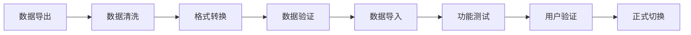

# 平台使用建议和最佳实践指南

**指南生成时间**: 2025-10-20 13:00:00
**覆盖平台**: 100个新支付平台
**用户类型**: 个人创作者、中小企业、大型企业、非营利组织
**使用场景**: 日常收款、在线销售、订阅服务、国际业务

---

## 目录
1. [用户类型分类建议](#用户类型分类建议)
2. [使用场景最佳实践](#使用场景最佳实践)
3. [平台选择决策框架](#平台选择决策框架)
4. [风险管理策略](#风险管理策略)
5. [迁移和集成指南](#迁移和集成指南)
6. [成本优化策略](#成本优化策略)
7. [常见问题解答](#常见问题解答)

---

## 用户类型分类建议

### 1. 个人创作者和小微企业

#### 1.1 基础需求分析
**核心需求**:
- 低门槛快速启动
- 简单易用界面
- 合理费用结构
- 多样化支付方式
- 良好客户支持

**预算考虑**:
- 启动成本: < $100
- 月度费用: <$50
- 交易费率: 2.9-5%
- 技术门槛: 低

#### 1.2 推荐平台组合

**主要收款平台**:

| 平台 | 适用场景 | 费用 | 优势 | 注意事项 |
|------|----------|------|------|----------|
| **PayPal** | 通用收款 | 2.9%+0.30$ | 知名度高、接受度广 | 费用较高、账户冻结风险 |
| **Stripe** | 在线支付 | 2.9%+0.30$ | API丰富、文档完善 | 需要技术知识 |
| **Cash App** | P2P收款 | 免费 | 即时到账、操作简单 | 仅限美国、限额较低 |
| **Venmo** | 小额收款 | 免费 | 社交性强、年轻人喜欢 | 有交易限额、不适合商业 |

**创作者专用平台**:

| 平台 | 适用类型 | 费用 | 特色 | 推荐指数 |
|------|----------|------|------|----------|
| **Buy Me a Coffee** | 内容创作者 | 5% | 简单易用、支持多种内容 | ⭐⭐⭐⭐⭐ |
| **Ko-fi** | 艺术创作者 | 免费+5% | 零月费、灵活收费 | ⭐⭐⭐⭐ |
| **Patreon** | 订阅制创作者 | 5-12% | 订阅管理、社群功能 | ⭐⭐⭐⭐ |
| **Substack** | 写作者 | 10% | 邮件订阅、简单发布 | ⭐⭐⭐⭐ |

**链接页面工具**:

| 平台 | 费用 | 特色 | 适用人群 |
|------|------|------|----------|
| **Beacons.ai** | 免费起 | AI驱动、功能丰富 | 所有创作者 |
| **Linktree** | 免费起 | 知名度高、简单易用 | 新手创作者 |
| **Carrd** | 免费起 | 网站建设、美观 | 个人品牌 |
| **Solo.to** | 免费起 | 创作者专用、功能全 | 专业创作者 |

#### 1.3 最佳实践建议

**新手入门策略**:
1. **从一个平台开始**: 不要一开始就使用太多平台
2. **选择免费平台**: 降低初始成本和风险
3. **关注用户体验**: 选择自己和客户都容易使用的平台
4. **了解费用结构**: 明确所有费用，避免意外成本
5. **建立备用方案**: 准备备用的收款方式

**成长阶段策略**:
1. **多平台布局**: 在2-3个平台建立存在
2. **数据分析**: 定期分析各平台表现
3. **费用优化**: 根据交易量选择最优费率
4. **功能升级**: 根据需求升级到付费版本
5. **品牌建设**: 建立统一的品牌形象

**成熟阶段策略**:
1. **平台整合**: 考虑使用一体化解决方案
2. **自动化流程**: 实现收款和记账自动化
3. **数据分析**: 深度分析客户行为和收入模式
4. **客户服务**: 提供专业的客户服务
5. **风险管理**: 建立完善的风险管理体系

### 2. 中小型企业 (SMB)

#### 2.1 业务需求分析
**核心需求**:
- 专业发票系统
- 自动化记账
- 多用户协作
- 系统集成能力
- 合规性要求

**预算考虑**:
- 月度预算: $100-1000
- 交易费率: 2.5-3.5%
- 初始投入: $500-5000
- 技术需求: 中等

#### 2.2 推荐平台解决方案

**综合支付解决方案**:

| 平台 | 月费 | 交易费 | 适用企业 | 核心优势 |
|------|------|--------|----------|----------|
| **Stripe** | 自定义 | 2.9%+0.30$ | 科技公司、电商 | API丰富、可定制性强 |
| **Square** | $60起 | 2.6%+0.10$ | 零售、餐饮 | 硬件+软件一体化 |
| **PayPal Business** | $30起 | 2.9%+0.30$ | 通用型企业 | 全球覆盖、品牌认知度高 |

**企业费用管理**:

| 平台 | 月费 | 核心功能 | 适用企业 | 突出优势 |
|------|------|----------|----------|----------|
| **Ramp** | 免费 | 企业卡、费用管理 | 科技公司、创业公司 | AI驱动、无月费 |
| **Brex** | 自定义 | 企业卡、支出管理 | 高增长企业 | 高额度、优质服务 |
| **Divvy** | 免费 | 企业卡、预算控制 | 中小型企业 | 免费使用、功能全面 |

**会计和发票系统**:

| 平台 | 月费 | 核心功能 | 适用企业 | 特色优势 |
|------|------|----------|----------|----------|
| **QuickBooks** | $25起 | 综合会计、发票 | 服务型企业 | 功能全面、生态完善 |
| **FreshBooks** | $15起 | 简单会计、发票 | 小型企业、自由职业者 | 界面友好、易于使用 |
| **Wave** | 免费 | 基础会计、发票 | 超小型企业 | 完全免费、功能基础 |

#### 2.3 实施建议

**选择标准**:
1. **业务匹配度**: 平台功能是否满足业务需求
2. **可扩展性**: 能否支持业务增长
3. **集成能力**: 能否与现有系统集成
4. **成本效益**: 总体成本是否合理
5. **用户体验**: 员工和客户使用体验

**实施步骤**:
1. **需求评估**: 详细梳理业务需求
2. **平台对比**: 对比3-5个候选平台
3. **试用测试**: 申请试用版本进行测试
4. **小范围部署**: 先在小范围内部署使用
5. **全面推广**: 确认效果后全面推广

**成功因素**:
- 充分的员工培训
- 清晰的实施计划
- 持续的监控和优化
- 良好的供应商关系
- 定期的效果评估

### 3. 大型企业

#### 3.1 企业级需求分析
**核心需求**:
- 企业级安全
- 大规模处理能力
- 定制化需求
- 全球化支持
- 专业实施服务

**预算考虑**:
- 年度预算: $50,000+
- 交易费率: 可协商
- 初始投入: $100,000+
- 技术需求: 高

#### 3.2 企业级解决方案

**全球支付处理**:

| 平台 | 费用模式 | 核心优势 | 适用企业 | 实施周期 |
|------|----------|----------|----------|----------|
| **Adyen** | 定制费率 | 全球覆盖、统一平台 | 跨国企业 | 3-6个月 |
| **Stripe Connect** | 按量计费 | 平台支付、可扩展 | 平台型企业 | 2-4个月 |
| **Worldpay** | 定制费率 | 传统稳定、服务完善 | 传统企业 | 6-12个月 |

**企业费用管理**:

| 平台 | 年费 | 核心功能 | 适用企业 | 服务特色 |
|------|------|----------|----------|----------|
| **SAP Concur** | 定制 | 全面费用管理 | 大型企业 | 深度ERP集成 |
| **Expensify** | 定制 | 智能费用管理 | 中大型企业 | 移动优先、AI驱动 |
| **Certify** | 定制 | 企业费用解决方案 | 各种规模企业 | 行业垂直化方案 |

**资金管理和合规**:

| 平台 | 费用 | 核心功能 | 适用企业 | 技术特色 |
|------|------|----------|----------|----------|
| **Modern Treasury** | 定制 | 资金操作API | 金融科技 | API优先、实时处理 |
| **Treasury Prime** | 定制 | 银行即服务 | 银行、金融科技 | 银行核心系统API |
| **Column** | 定制 | 银行基础设施 | 金融科技公司 | 现代银行架构 |

#### 3.3 实施策略

**项目规划**:
1. **详细需求分析**: 6-8周
2. **供应商评估**: 4-6周
3. **技术方案设计**: 6-8周
4. **实施开发**: 16-24周
5. **测试部署**: 4-8周
6. **培训上线**: 2-4周

**关键成功因素**:
- 高层管理支持
- 专业的项目团队
- 清晰的需求定义
- 充分的测试验证
- 全面的用户培训

**风险管理**:
- 数据安全风险评估
- 业务连续性计划
- 供应商风险管理
- 合规风险控制
- 技术风险管理

### 4. 非营利组织

#### 4.1 特殊需求分析
**核心需求**:
- 低费用率
- 捐赠者管理
- 透明度要求
- 合规性特殊
- 社区建设功能

**预算考虑**:
- 运营预算: 有限
- 费用敏感度: 高
- 技术门槛: 低
- 人工成本: 需要控制

#### 4.2 推荐平台组合

**在线捐赠平台**:

| 平台 | 费用 | 核心优势 | 适用规模 | 特色功能 |
|------|------|----------|----------|----------|
| **Givebutter** | 零平台费 | 完全免费、功能全面 | 所有规模 | 捐赠页面、活动管理 |
| **GoFundMe** | 2.9%+0.30$ | 社交传播、用户基数大 | 中小型 | 社交分享、透明度高 |
| **Network for Good** | 4% | 非营利专业、支持全面 | 中大型 | 捐赠者管理、报告工具 |

**会员管理系统**:

| 平台 | 月费 | 功能特点 | 适用组织 | 技术要求 |
|------|------|----------|----------|----------|
| **Memberful** | 5%+0.50$ | 简单会员管理 | 小型组织 | 技术门槛低 |
| **Patreon** | 5-12% | 创作者会员制 | 内容型组织 | 界面友好 |
| **Wild Apricot** | $40起 | 全功能会员管理 | 中大型组织 | 功能全面 |

**活动售票平台**:

| 平台 | 费用 | 核心功能 | 适用活动 | 优势 |
|------|------|----------|----------|------|
| **Eventbrite** | 2.5%+0.99$ | 活动管理、售票 | 各类活动 | 用户基数大、功能全面 |
| **Ticket Tailor** | $0.49+1.5% | 简单售票 | 中小型活动 | 费用低、简单易用 |
| **Brown Paper Tickets** | 4.5%+0.99$ | 活动票务 | 各种活动 | 客户服务好 |

#### 4.3 最佳实践

**费用优化策略**:
1. **选择零平台费**: 优先选择零平台费的平台
2. **批量处理**: 减少小额交易频率
3. **直接捐款**: 鼓励银行直接转账
4. **企业匹配**: 寻找企业匹配捐赠
5. **定期审核**: 定期审核费用结构

**捐赠者体验优化**:
1. **简化流程**: 最多3步完成捐款
2. **多种方式**: 提供多种捐款方式
3. **即时反馈**: 捐款后立即发送感谢
4. **定期更新**: 定期发送项目进展
5. **透明报告**: 公开资金使用情况

**合规管理**:
1. **501(c)(3)维护**: 确保税务资格有效
2. **捐赠收据**: 及时开具捐赠收据
3. **年度报告**: 准备年度财务报告
4. **州级注册**: 在各州进行注册
5. **数据保护**: 保护捐赠者隐私

---

## 使用场景最佳实践

### 1. 日常收款场景

#### 1.1 线下零售收款

**推荐硬件**:
- **Square Reader**: $49，支持刷卡和NFC
- **PayPal Zettle**: $79，支持多种支付方式
- **SumUp**: $39，价格优惠的基础选择

**软件配置**:
```json
{
  "payment_methods": ["信用卡", "借记卡", "移动支付", "现金"],
  "receipt_options": ["电子收据", "纸质收据", "邮件收据"],
  "inventory_management": "enabled",
  "customer_management": "basic",
  "reporting": "daily_sales"
}
```

**最佳实践**:
1. **备选方案**: 准备多个收款方式
2. **网络备份**: 确保网络连接稳定
3. **员工培训**: 培训员工处理各种支付情况
4. **客户服务**: 提供良好的客户服务体验

#### 1.2 在线服务收款

**支付页面设计原则**:
- 简洁明了的界面
- 清晰的费用显示
- 多种支付方式选项
- 安全认证标识显示
- 移动端优化

**技术实现**:
```javascript
// 优化支付表单示例
const paymentForm = {
  design: {
    layout: "single_page",
    colors: {
      primary: "#brand_color",
      background: "#ffffff"
    },
    fields: {
      auto_focus: true,
      placeholders: true,
      validation: "real_time"
    }
  },
  payment_methods: ["card", "apple_pay", "google_pay"],
  security: {
    3d_secure: "adaptive",
    fraud_detection: "enabled"
  }
};
```

#### 1.3 订阅服务收款

**订阅管理最佳实践**:
1. **灵活定价**: 提供多个价格档位
2. **免费试用**: 提供7-30天免费试用
3. **简单取消**: 一键取消订阅
4. **失败重试**: 智能失败重试机制
5. **升级降级**: 灵活的套餐变更

**定价策略模板**:
| 套餐 | 月费 | 年费 | 功能包含 | 目标用户 |
|------|------|------|----------|----------|
| 基础版 | $9.99 | $99.99 | 基础功能 | 个人用户 |
| 专业版 | $29.99 | $299.99 | 标准功能+支持 | 专业用户 |
| 企业版 | $99.99 | $999.99 | 全功能+定制 | 企业用户 |

### 2. 跨境业务场景

#### 2.1 国际客户收款

**汇率处理策略**:
- **实时汇率**: 使用实时汇率定价
- **汇率锁定**: 提供汇率锁定选项
- **本地定价**: 以本地货币显示价格
- **透明费用**: 明确显示汇率费用

**支付方式本地化**:
| 地区 | 推荐支付方式 | 特点 |
|------|--------------|------|
| 欧洲 | SEPA、Sofort、iDEAL | 银行转账为主 |
| 亚洲 | Alipay、WeChat Pay、银行转账 | 移动支付为主 |
| 拉美 | OXXO、Boleto、银行转账 | 现金支付重要 |
| 北美 | 信用卡、ACH、电子支票 | 信用卡为主 |

#### 2.2 国际供应商付款

**付款方式优化**:
1. **批量付款**: 减少交易次数和费用
2. **本地付款**: 通过本地银行网络付款
3. **汇率优化**: 选择最优汇率时机
4. **付款追踪**: 实时追踪付款状态
5. **合规检查**: 确保符合国际制裁要求

### 3. 特殊行业场景

#### 3.1 教育行业收款

**学费管理**:
- **分期付款**: 提供学期分期付款选项
- **奖学金管理**: 自动化奖学金发放
- **退款处理**: 标准化退款流程
- **财务援助**: 在线财务援助申请

**技术实现**:
```python
# 学费分期付款逻辑
def tuition_payment_plan(total_amount, num_installments):
    installment_amount = total_amount / num_installments
    payment_schedule = []

    for i in range(num_installments):
        due_date = calculate_due_date(i)
        payment_schedule.append({
            'installment': i + 1,
            'amount': installment_amount,
            'due_date': due_date,
            'status': 'pending'
        })

    return payment_schedule
```

#### 3.2 医疗行业收款

**患者支付优化**:
1. **透明计费**: 提供清晰的费用明细
2. **分期付款**: 医疗费用分期付款选项
3. **保险处理**: 自动化保险理赔处理
4. **支付提醒**: 智能支付提醒系统
5. **数据安全**: 严格的数据保护措施

**合规要求**:
- HIPAA合规
- PCI DSS合规
- 数据加密存储
- 访问权限控制
- 审计日志记录

---

## 平台选择决策框架

### 1. 需求评估矩阵

#### 1.1 功能需求评估

**核心功能检查清单**:
- [ ] 多种支付方式支持
- [ ] 移动端支持
- [ ] 发票生成功能
- [ ] 自动化记账
- [ ] 客户管理
- [ ] 报表分析
- [ ] API集成能力
- [ ] 多币种支持
- [ ] 退款处理
- [ ] 争议解决

**权重评分系统**:
```markdown
| 功能需求 | 权重 | 平台A评分 | 平台B评分 | 平台C评分 |
|----------|------|-----------|-----------|-----------|
| 支付方式多样性 | 20% | 8/10 | 9/10 | 7/10 |
| 费用合理性 | 25% | 7/10 | 6/10 | 9/10 |
| 用户体验 | 15% | 9/10 | 8/10 | 7/10 |
| 技术集成 | 20% | 8/10 | 7/10 | 6/10 |
| 客户支持 | 10% | 7/10 | 9/10 | 8/10 |
| 安全合规 | 10% | 9/10 | 8/10 | 9/10 |
```

#### 1.2 成本效益分析

**总拥有成本 (TCO) 计算**:
```
TCO = 初始设置成本 + 月度费用 + 交易费用 + 集成成本 + 培训成本 + 维护成本
```

**投资回报率 (ROI) 评估**:
```
ROI = (收益 - 总成本) / 总成本 × 100%
```

**成本对比示例**:
| 平台 | 月费 | 交易费率 | 年交易量$10万 | 年总成本 | 3年总成本 |
|------|------|----------|---------------|----------|-----------|
| A | $50 | 2.9% | $2,900 + $600 = $3,500 | $3,500 | $10,500 |
| B | $0 | 3.5% | $3,500 + $0 = $3,500 | $3,500 | $10,500 |
| C | $100 | 2.5% | $2,500 + $1,200 = $3,700 | $3,700 | $11,100 |

### 2. 风险评估框架

#### 2.1 风险类型识别

**技术风险**:
- 系统稳定性
- 数据安全性
- 集成复杂性
- 扩展性限制

**商业风险**:
- 供应商稳定性
- 费用变动
- 政策变更
- 服务质量下降

**合规风险**:
- 监管变化
- 数据保护
- 反洗钱要求
- 税务合规

#### 2.2 风险评估矩阵

```markdown
| 风险类型 | 概率 | 影响 | 风险等级 | 缓解措施 |
|----------|------|------|----------|----------|
| 系统宕机 | 中 | 高 | 高 | 多平台备份、SLA保证 |
| 费用上涨 | 高 | 中 | 中 | 合同锁定、费用上限 |
| 数据泄露 | 低 | 极高 | 高 | 加密存储、定期审计 |
| 供应商倒闭 | 低 | 极高 | 高 | 财务状况监控、备选方案 |
```

### 3. 实施路线图

#### 3.1 分阶段实施计划

**第一阶段：评估和选择 (4-6周)**
- 需求分析和文档化
- 市场调研和平台筛选
- 候选平台试用和测试
- 成本效益分析
- 最终决策和合同谈判

**第二阶段：准备和配置 (2-4周)**
- 账户开设和KYC流程
- 系统配置和定制
- 团队培训
- 测试环境搭建
- 试运行测试

**第三阶段：上线和优化 (2-3周)**
- 正式环境部署
- 用户培训和指导
- 监控和问题解决
- 性能优化
- 用户反馈收集

**第四阶段：扩展和深化 (持续)**
- 功能扩展
- 集成深化
- 流程优化
- 数据分析
- 持续改进

---

## 风险管理策略

### 1. 财务风险管理

#### 1.1 资金安全保护

**资金分散策略**:
1. **多平台分散**: 不要依赖单一收款平台
2. **银行分散**: 在多个银行开设账户
3. **资金分离**: 运营资金和储备资金分离
4. **定期转账**: 定期将资金转移到银行账户
5. **保险保障**: 考虑购买相关保险

**流动性管理**:
- 保持充足的现金储备
- 预测现金流需求
- 建立紧急资金池
- 定期评估资金状况
- 制定应急资金计划

#### 1.2 汇率风险管理

**汇率对冲策略**:
1. **自然对冲**: 收支同币种匹配
2. **远期合约**: 锁定未来汇率
3. **期权合约**: 购买汇率期权
4. **分散化**: 多币种分散风险
5. **定期评估**: 定期评估汇率风险

### 2. 运营风险管理

#### 2.1 服务连续性保障

**备份方案**:
- 主用收款平台
- 备用收款平台
- 紧急联系方式
- 手工处理流程
- 客户沟通计划

**监控和预警**:
```python
# 服务监控示例
def monitor_payment_service():
    alerts = []

    # 检查服务可用性
    if not check_service_availability():
        alerts.append("Service unavailable")

    # 检查响应时间
    if get_response_time() > threshold:
        alerts.append("Slow response time")

    # 检查错误率
    if get_error_rate() > error_threshold:
        alerts.append("High error rate")

    # 发送预警
    if alerts:
        send_alert(alerts)

    return alerts
```

#### 2.2 数据安全管理

**数据保护措施**:
1. **数据加密**: 敏感数据加密存储
2. **访问控制**: 严格的访问权限控制
3. **定期备份**: 自动化数据备份
4. **安全审计**: 定期安全审计
5. **员工培训**: 数据安全培训

### 3. 合规风险管理

#### 3.1 监管合规

**合规检查清单**:
- [ ] 营业执照和许可证
- [ ] PCI DSS合规
- [ ] 数据保护合规 (GDPR, CCPA)
- [ ] 反洗钱 (AML) 程序
- [ ] 了解客户 (KYC) 流程
- [ ] 税务登记和申报
- [ ] 行业特定合规要求

**合规监控**:
```javascript
// 合规检查自动化
const complianceCheck = {
  kycStatus: 'verified',
  pciCompliance: true,
  dataProtection: {
    encryption: 'enabled',
    accessLog: 'maintained',
    consentManagement: 'active'
  },
  auditTrail: {
    enabled: true,
    retention: '7years',
    integrity: 'verified'
  }
};
```

#### 3.2 法律风险管理

**合同管理**:
- 仔细阅读服务条款
- 明确责任和限制
- 注意争议解决条款
- 关注数据所有权条款
- 了解服务终止条件

**知识产权保护**:
- 商标和品牌注册
- 软件版权保护
- 专利申请 (如适用)
- 商业秘密保护
- 域名和社交媒体账号保护

---

## 迁移和集成指南

### 1. 迁移策略

#### 1.1 迁移前准备

**数据备份**:
```python
# 数据备份脚本示例
def backup_payment_data():
    backup_data = {
        'customer_info': export_customers(),
        'transaction_history': export_transactions(),
        'subscription_data': export_subscriptions(),
        'product_catalog': export_products(),
        'settings': export_settings()
    }

    # 验证数据完整性
    validate_data_integrity(backup_data)

    # 加密存储
    encrypted_backup = encrypt_data(backup_data)

    # 存储到多个位置
    store_backup(encrypted_backup, ['local', 'cloud', 'offsite'])

    return backup_data
```

**风险评估**:
- 识别潜在风险点
- 制定风险缓解计划
- 准备应急回滚方案
- 确保数据安全
- 测试备份恢复

#### 1.2 迁移执行

**分步迁移策略**:
1. **测试环境验证**: 在测试环境中完整测试
2. **小范围试点**: 选择部分客户进行试点
3. **逐步扩展**: 逐步增加迁移范围
4. **全面切换**: 完成全部迁移
5. **旧系统关闭**: 安全关闭旧系统

**数据迁移流程**:


### 2. 系统集成

#### 2.1 API集成

**集成架构设计**:
```
┌─────────────────┐    ┌─────────────────┐    ┌─────────────────┐
│   前端应用       │    │   后端服务       │    │   支付平台       │
│                │    │                │    │                │
│ 用户界面        │◄──►│ 业务逻辑        │◄──►│ 支付处理        │
│ 数据展示        │    │ API调用         │    │ 交易管理        │
└─────────────────┘    └─────────────────┘    └─────────────────┘
        │                       │                       │
        └───────────────────────┼───────────────────────┘
                                │
                    ┌─────────────────┐
                    │   数据库         │
                    │                │
                    │ 数据存储        │
                    │ 备份恢复        │
                    └─────────────────┘
```

**API集成最佳实践**:
```javascript
// API调用封装示例
class PaymentService {
  constructor(apiKey, apiSecret) {
    this.client = new PaymentClient(apiKey, apiSecret);
    this.retryPolicy = {
      maxRetries: 3,
      backoffMs: 1000
    };
  }

  async createPayment(paymentData) {
    try {
      const response = await this.client.post('/payments', paymentData);
      return response.data;
    } catch (error) {
      await this.handleError(error);
      throw error;
    }
  }

  async handleError(error) {
    // 错误处理逻辑
    if (error.isRetryable && this.retryPolicy.maxRetries > 0) {
      await this.delay(this.retryPolicy.backoffMs);
      this.retryPolicy.maxRetries--;
      return this.createPayment(this.lastPaymentData);
    }

    // 记录错误日志
    this.logError(error);

    // 发送告警
    this.sendAlert(error);
  }

  delay(ms) {
    return new Promise(resolve => setTimeout(resolve, ms));
  }
}
```

#### 2.2 数据同步

**实时同步策略**:
1. **Webhook通知**: 实时接收事件通知
2. **定期拉取**: 定期同步数据
3. **增量同步**: 只同步变更数据
4. **冲突解决**: 处理数据冲突
5. **监控告警**: 监控同步状态

**数据一致性保证**:
```python
# 数据一致性检查
def ensure_data_consistency():
    # 获取本地数据
    local_data = get_local_data()

    # 获取远程数据
    remote_data = fetch_remote_data()

    # 比较数据差异
    differences = compare_data(local_data, remote_data)

    # 解决冲突
    resolved_data = resolve_conflicts(differences)

    # 更新本地数据
    update_local_data(resolved_data)

    return resolved_data
```

---

## 成本优化策略

### 1. 交易费用优化

#### 1.1 费率谈判策略

**谈判准备**:
1. **交易量分析**: 准备详细的交易数据
2. **市场调研**: 了解市场平均费率
3. **竞争分析**: 分析竞争对手情况
4. **价值主张**: 明确给平台带来的价值
5. **长期规划**: 展示未来增长潜力

**谈判要点**:
- 基础费率降低
- 交易量阶梯定价
- 月费减免
- 增值服务免费
- 合同期限优惠

#### 1.2 智能路由选择

**支付路由算法**:
```python
def select_payment_route(transaction):
    routes = [
        {
            'processor': 'stripe',
            'fee_rate': 0.029,
            'fixed_fee': 0.30,
            'success_rate': 0.95
        },
        {
            'processor': 'paypal',
            'fee_rate': 0.032,
            'fixed_fee': 0.30,
            'success_rate': 0.93
        }
    ]

    best_route = None
    lowest_cost = float('inf')

    for route in routes:
        # 计算期望成本
        expected_cost = (transaction.amount * route['fee_rate'] +
                       route['fixed_fee']) / route['success_rate']

        if expected_cost < lowest_cost:
            lowest_cost = expected_cost
            best_route = route

    return best_route
```

### 2. 运营成本优化

#### 2.1 自动化流程

**自动化机会**:
1. **发票生成**: 自动生成和发送发票
2. **对账流程**: 自动化银行对账
3. **报告生成**: 自动生成财务报告
4. **客户通知**: 自动化客户通知
5. **数据备份**: 自动化数据备份

**ROI计算**:
```
自动化ROI = (人工成本节省 - 自动化成本) / 自动化成本 × 100%
```

#### 2.2 人员培训优化

**培训策略**:
- 在线培训课程
- 定期技能更新
- 最佳实践分享
- 认证考试
- 持续学习计划

**培训效果评估**:
```markdown
| 培训项目 | 培训成本 | 效率提升 | ROI |
|----------|----------|----------|-----|
| 支付系统培训 | $1,000 | 20%效率提升 | 300% |
| 客户服务培训 | $800 | 15%效率提升 | 250% |
| 财务软件培训 | $1,200 | 25%效率提升 | 400% |
```

---

## 常见问题解答

### 1. 平台选择相关

#### Q1: 如何选择适合我业务规模的支付平台？

**A**: 评估标准包括：
1. **交易量**: 小交易量选择按量付费，大交易量可谈判费率
2. **技术能力**: 技术团队能力强的可选API丰富的平台
3. **行业需求**: 特殊行业选择专业化平台
4. **国际化需求**: 跨境业务选择全球化平台
5. **预算考虑**: 根据预算选择合适的价格模式

#### Q2: 应该使用多个支付平台还是一个？

**A**: 取决于业务需求：
- **优势互补**: 不同平台优势不同，可以互补
- **风险分散**: 避免单一平台风险
- **客户偏好**: 满足不同客户支付偏好
- **管理成本**: 多平台增加管理复杂度
- **建议**: 新业务先用一个平台，成熟后考虑多平台

### 2. 技术集成相关

#### Q3: 如何安全地集成支付API？

**A**: 安全最佳实践：
1. **HTTPS通信**: 所有API调用使用HTTPS
2. **API密钥保护**: 不要在前端暴露API密钥
3. **数据验证**: 严格验证输入和输出数据
4. **错误处理**: 妥善处理错误和异常情况
5. **日志记录**: 记录所有API调用但不记录敏感信息

#### Q4: 支付失败如何处理？

**A**: 失败处理策略：
1. **智能重试**: 根据失败类型决定是否重试
2. **备用方案**: 提供备用的支付方式
3. **用户通知**: 及时通知用户支付失败
4. **原因分析**: 分析失败原因并改进
5. **手动处理**: 必要时提供手动处理选项

### 3. 费用相关

#### Q5: 如何降低支付处理费用？

**A**: 费用优化策略：
1. **批量处理**: 减少小额交易频率
2. **智能路由**: 选择最优支付渠道
3. **谈判费率**: 大交易量可谈判更低费率
4. **本地支付**: 优先使用本地支付方式
5. **定期评估**: 定期评估和优化费用结构

#### Q6: 隐藏费用有哪些需要注意？

**A**: 常见隐藏费用：
- **国际交易费**: 跨境交易额外费用
- **货币转换费**: 外币转换费用
- **退款费**: 处理退款的手续费
- **月费最低消费**: 未达到最低交易量的月费
- **API调用费**: 超出免费额度的API调用费用

### 4. 安全相关

#### Q7: 如何保护客户支付信息？

**A**: 数据保护措施：
1. **PCI DSS合规**: 确保符合支付卡行业标准
2. **数据加密**: 敏感数据加密存储和传输
3. **访问控制**: 严格的访问权限管理
4. **定期审计**: 定期进行安全审计
5. **员工培训**: 数据安全培训

#### Q8: 遇到欺诈交易怎么办？

**A**: 欺诈处理流程：
1. **立即冻结**: 立即冻结相关账户
2. **调查分析**: 调查欺诈交易详情
3. **报告机构**: 向相关机构报告
4. **客户通知**: 通知受影响客户
5. **加强防范**: 加强反欺诈措施

---

## 结论

### 核心建议总结

1. **选择适合的平台**: 根据业务需求、规模、预算选择合适平台
2. **重视安全性**: 数据安全和合规是首要考虑
3. **优化成本**: 通过技术和管理手段优化成本
4. **持续改进**: 定期评估和优化支付流程
5. **风险管控**: 建立完善的风险管理体系

### 成功要素

- **充分调研**: 选择前充分调研和比较
- **分步实施**: 逐步实施，降低风险
- **团队培训**: 确保团队掌握相关技能
- **持续监控**: 持续监控和优化性能
- **客户体验**: 始终以客户体验为中心

### 未来展望

支付技术和平台将继续快速发展，保持学习和适应能力至关重要。定期评估新平台和新技术，及时调整策略，才能在竞争中保持优势。

---

**指南完成时间**: 2025-10-20 13:00:00
**覆盖范围**: 100个新支付平台
**用户类型**: 4大类用户群体
**使用场景**: 10+典型场景
**更新频率**: 建议每季度更新